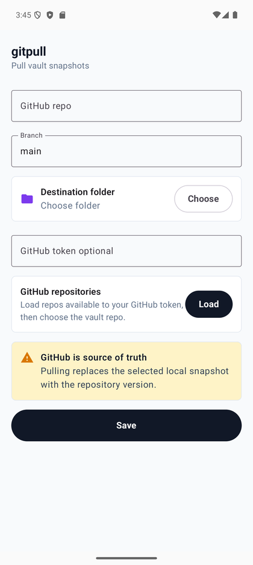
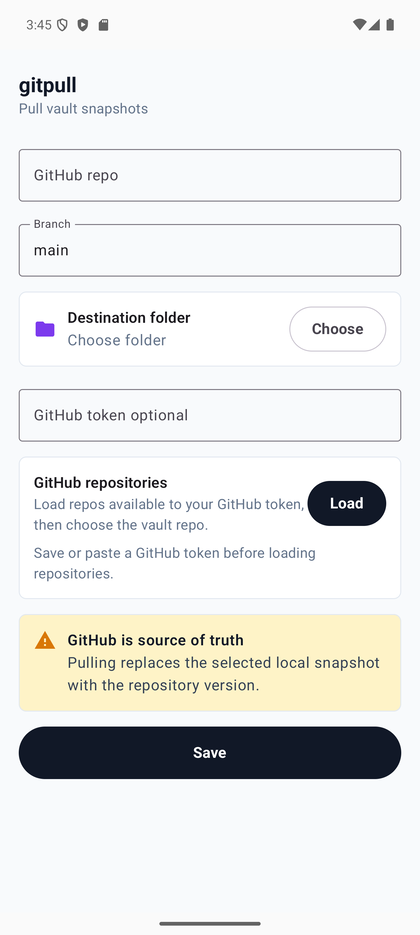
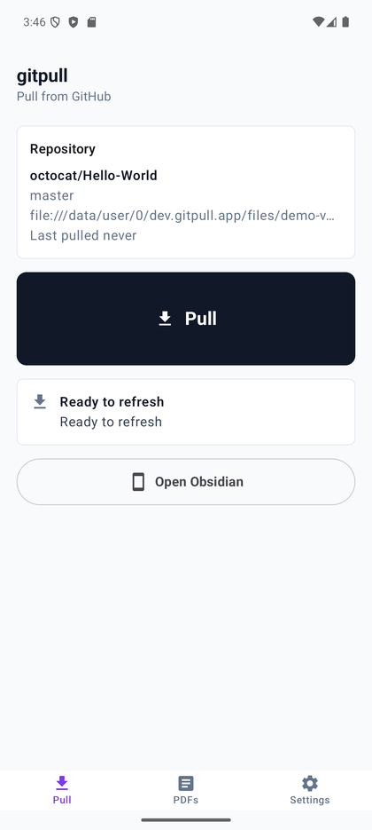
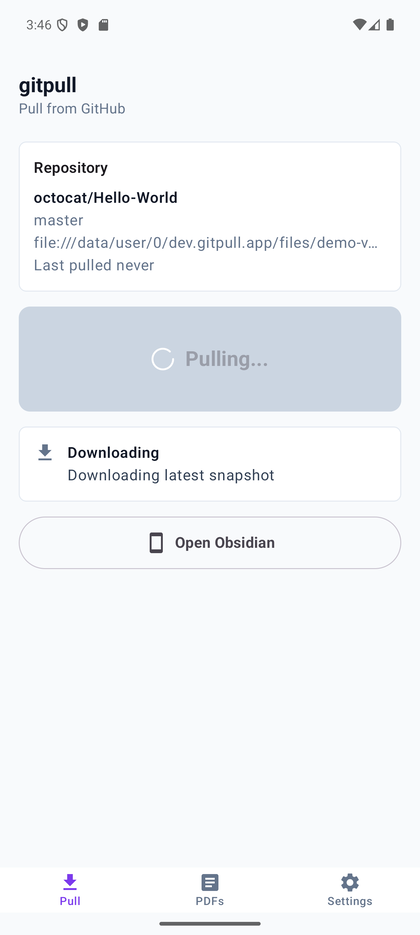
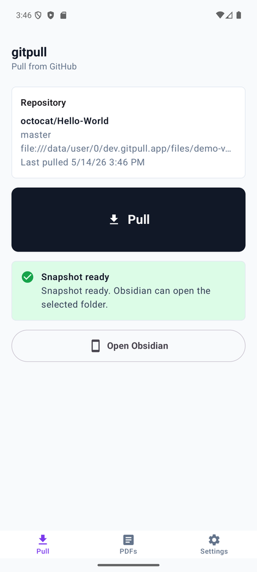
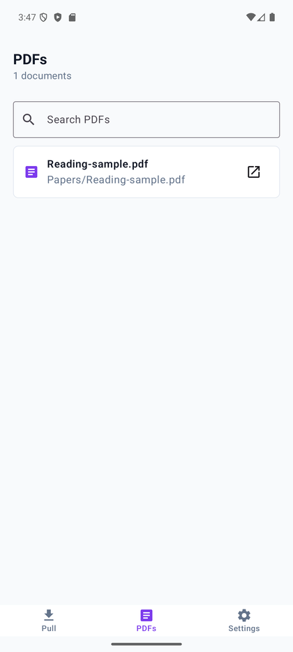
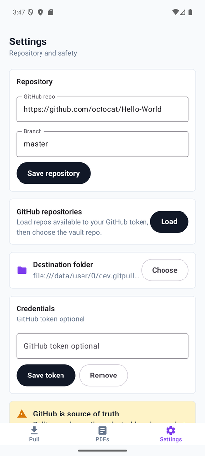
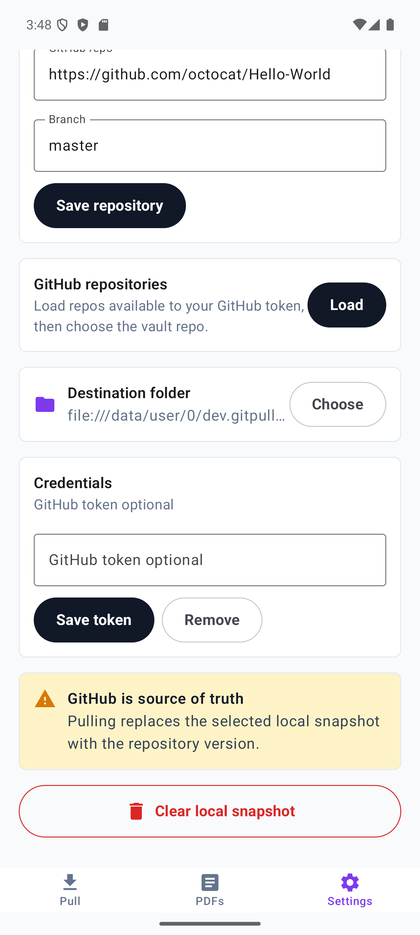

# Visual Walkthrough

These screenshots were retaken on a Pixel 9 Pro XL Android emulator at 1344x2992 after verifying the app respects Android safe areas.

## Setup

Open `gitpull`, enter a repository or load repositories from a GitHub token, choose a vault folder, then save the configuration.

If you paste or save a GitHub token, the repository browser can load repos available to that token.

## Pull

The Pull tab shows the selected repository, branch, destination folder, last pull time, and the main Pull action.

During a refresh, the app disables the button and shows pull progress.

When the snapshot is ready, Obsidian Mobile can open the selected folder as the vault.

## PDFs

The PDFs tab indexes pulled PDF files so they can be opened through Android's standard open-with flow.

## Settings

Settings let you update the repository, reload repository choices, change the destination folder, manage the GitHub token, and clear the local snapshot.

